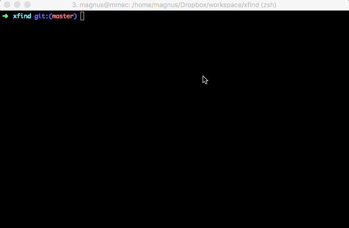

Xfind - find at eXternal machines and drives
-------------------------------------------------------------------------------

Xfind a new idea to do mmfinder (https://github.com/mmagnus/mmfinder). This is more like a concept so I encourge you to fork it if you wish and change it for setup.

server <-> client:

    magnus@malibu:~/bin$ cat xfind.sh
    locate -d ~/.local.db $@

    magnus@malibu:~/bin$ cat xfind_update.sh
    updatedb --require-visibility 0 -o  ~/.local.db -U /home/magnus;

and make dbs of external drives:

    updatedb --require-visibility 0 -o  ~/.hd.db -U /mmt/HD;

Good:

- fast!
- update under crontab on remote machines
- offline locate search for drives

Bad:

- you have to have access to machines to do a search (or istead of ssh /cmd/ do a local database sshfs-ed drive (ee external drives) 

..

    export LOCATE_PATH="/home/magnus/.locate-mac"

Aliases:

    # locate
    alias updatex='updatedb --require-visibility 0 -o  ~/.local.db -U /home/magnus;'
    alias locatex="locate -d ~/.locate.db " 

Warning. Be careful to name your dbs correctly in locate and updatedb. ^ you can see even in this example I did this wrong!

Test: search for "yjdf" :-)

To check if everything is fine, you can preview your bash scripts at VMs with this::

	[mm] xfind git:(master) ✗ ./xfind_check.sh
	malibu
	---------------------
	locate -d ~/.local_locate.db $@
	updatedb --require-visibility 0 -o  ~/.local_locate.db -U /home/magnus;
	peyote
	---------------------
	echo '>> locate'
	locate -d ~/.local_locate.db $@
	echo '>> archive'
	locate -d ~/.archive_locate.db $@
	updatedb --require-visibility 0 -o  ~/.local_locate.db -U /home/magnus
	updatedb --require-visibility 0 -o  ~/.archive_locate.db -U /archive/magnus
