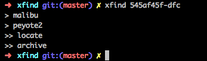

xfind - find at remote machines
-------------------------------------------------------------------------------
xfind:

server <-> client:

    magnus@malibu:~/bin$ cat xfind.sh
    locate -d ~/.local.db $@

    magnus@malibu:~/bin$ cat xfind_update.sh
    updatedb --require-visibility 0 -o  ~/.local.db -U /home/magnus;

Good:

- update under crontab

Bad:

- you have to have access to find
